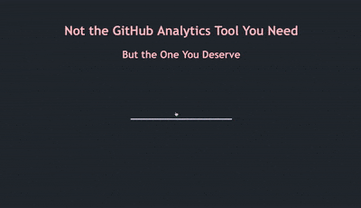

## CS3012 Github Access Assignment

The first part of this assignment was to interrogate the GitHub API to retrieve and display data about the selected user. 

I used the Axios JS library to complete this part of the assignment. Axios is a JavaScript library for performing HTTP requests. I bootstrapped the project with [Create React App](https://github.com/facebook/create-react-app).

The second part of the assignment was to again interrogate the GitHub API to build visualisations of software metrics available. 

I used the Plotly JS library to implement the graphs in my project. Plotly is built on the d3 JS library and stack.gl. 

